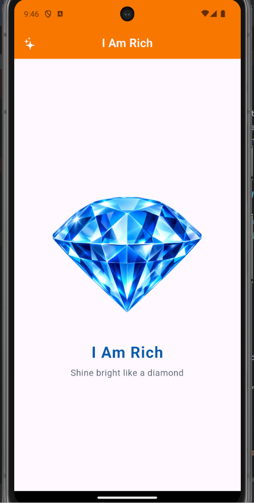

# Flutter Lab 01 — I Am Rich

Ứng dụng Flutter đầu tiên trong bộ 9 bài lab. Màn hình hiển thị viên kim cương xanh cùng dòng chữ **I Am Rich**, giúp thực hành xây dựng giao diện với widget, Material Design, Cupertino Icons và quản lý tài nguyên hình ảnh.

## Ảnh chụp ứng dụng



Ảnh chụp ứng dụng chạy trên Android.

## Nội dung thực hiện

- Tạo ứng dụng Flutter với `MaterialApp`, `Scaffold`, `AppBar` và các widget bố cục.
- Hiển thị ảnh kim cương từ `images/diamond.png` bằng `Image.asset`.
- Khai báo tài nguyên trong `pubspec.yaml`.
- Áp dụng Material Design và một biểu tượng từ `cupertino_icons`.
- Thêm widget test kiểm tra tiêu đề, ảnh và nội dung chính.

## Yêu cầu

- Flutter SDK tương thích với phiên bản Dart trong `pubspec.yaml`.
- Android SDK và máy ảo/thiết bị Android để chạy ứng dụng.

## Chạy ứng dụng

```bash
flutter pub get
flutter run
```

## Kiểm tra

```bash
flutter analyze
flutter test
```

Mã nguồn giao diện: [`lib/main.dart`](lib/main.dart). Tài nguyên ảnh: [`images/diamond.png`](images/diamond.png).
